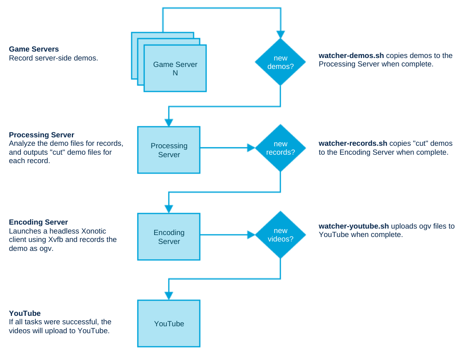

## About

This project was built to provide a method for automatically uploading videos of flag capture records to YouTube after matches are complete.

That's an over-simplification, see below.

### Process Flow



## Installation

#### File Watching

The watcher scripts require `inotifywait` on any server a watcher script lives.

```
sudo apt-get install inotify-tools
```

#### Headless Encoding

Xonotic. You need Xonotic. You should know how to get Xonotic. Get Xonotic.

Install Xvfb and libvorbis:

```bash
sudo apt-get install xvfb xinit libvorbisenc2 libvorbis-dev libogg-dev libsdl1.2debian libtheora0
```

Create needed directories in your `$USER_DIR`:

```bash
mkdir -p ~/.xonotic/data/records/{working,videos}
mkdir ~/.xonotic/data/records/working/{sliced,archived}
mkdir ~/.xonotic/data/video
```

#### YouTube Uploads

Create a Python 2 venv and install the dependencies:

```bash
virtualenv venv
ln -s venv/bin/activate
source activate
pip install -r requirements.txt
```

Create OAuth2 credentials for type 'other' at https://console.developers.google.com/apis/credentials.

Download the json for this OAuth2 client ID and save it as `client_secrets.json` in this project's root dir.

The first time you run this, you will be asked to allow the app to use a youtube account in the web browser.

## Configuration

Create a `config/config.conf` file:

`cp config/example.config.conf config/config.conf`

Edit it to fit your setup. Currently the example assumes one system for all logical servers.

Check out `config/example.autoexec.cfg` for an example config you can use on your encoding server.


## Usage

You can start it all on a single server with the following command (though you should read up on tmux a bit first):

`tmuxp load config/tmux.default.yaml`

To test it, put a demo file that has flag capture records in the `$DEMO_DIR` folder. That is, the folder that the `watcher-demos.sh` script is watching.

This watcher script kicks off a chain reaction that the other watchers will pick up on. If the files match the criteria, they advance to the next watcher.

### Old notes about how it works

#### Demo recording

server-side demos can be enabled with the following cvar:

```
sv_autodemo_perclient 1
```

#### Demo Slicing

```bash
./demotc-ctf-record-extractor.sh my-demo.dem new
```

This command will create many .dem files, the ones we are interested in are 'capture-*.dem'

#### Headless Encoding

Start Xvfb

```bash
Xvfb :1 -screen 0 800x600x16
```

Encoding a demo

```bash
DISPLAY=:1.0 ./all run -userdir ~/.xonotic +playdemo demos/capture-2.dem
```

#### Uploads

You need to be inside the venv to run the following.

`source activate` will put you in the venv. and `deactivate` will exit the venv.

```bash
./upload.py --file="my-video.ogv" \
                       --title="test" \
                       --description="testing upload" \
                       --keywords="xonotic" \
                       --category="22" \
                       --privacyStatus="private"
```

#### Tips and Tricks

find and copy a bunch of old demos to be parsed automatically by the system:

```
find . -regex ".*\(moonstone\|mIKE1\|polo3ctf\).*" -exec cp {} ~/.xonotic/data/sv_autodemos \;
```

Kill Xvfb (shouldn't need this when I figure out remain-on-exit in tmuxp):

```
kill -9 $(pgrep Xvfb)
```

### Development

If you're a vim and tmux user, you might like this config I use for local development:

`tmuxp load config/tmux.default.dev`
